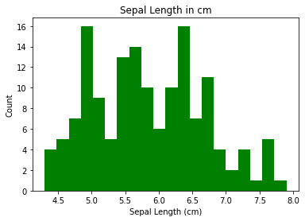
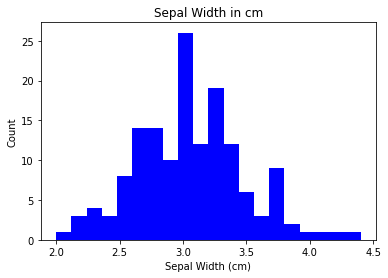

## Analysis of Fisher’s Iris data set
#### Author: Prasanth Sukumar


```python
import pandas as pd
import matplotlib.pyplot as plt
import seaborn as sns
```


```python
names=["sepal_length","sepal_width", "petal_length","petal_width","class"]
df = pd.read_csv('iris.data', header=None, names=names)
df.head()
```


<div>
<style scoped>
    .dataframe tbody tr th:only-of-type {
        vertical-align: middle;
    }

    .dataframe tbody tr th {
        vertical-align: top;
    }

    .dataframe thead th {
        text-align: right;
    }
</style>
<table border="1" class="dataframe">
  <thead>
    <tr style="text-align: right;">
      <th></th>
      <th>sepal_length</th>
      <th>sepal_width</th>
      <th>petal_length</th>
      <th>petal_width</th>
      <th>class</th>
    </tr>
  </thead>
  <tbody>
    <tr>
      <th>0</th>
      <td>5.1</td>
      <td>3.5</td>
      <td>1.4</td>
      <td>0.2</td>
      <td>Iris-setosa</td>
    </tr>
    <tr>
      <th>1</th>
      <td>4.9</td>
      <td>3.0</td>
      <td>1.4</td>
      <td>0.2</td>
      <td>Iris-setosa</td>
    </tr>
    <tr>
      <th>2</th>
      <td>4.7</td>
      <td>3.2</td>
      <td>1.3</td>
      <td>0.2</td>
      <td>Iris-setosa</td>
    </tr>
    <tr>
      <th>3</th>
      <td>4.6</td>
      <td>3.1</td>
      <td>1.5</td>
      <td>0.2</td>
      <td>Iris-setosa</td>
    </tr>
    <tr>
      <th>4</th>
      <td>5.0</td>
      <td>3.6</td>
      <td>1.4</td>
      <td>0.2</td>
      <td>Iris-setosa</td>
    </tr>
  </tbody>
</table>
</div>


## Explore Data

#### Use the 'shape' attribute to check the number of rows and cloumns in the data frame.


```python
df.shape
```


    (150, 5)


```python
df.info()
```

    <class 'pandas.core.frame.DataFrame'>
    RangeIndex: 150 entries, 0 to 149
    Data columns (total 5 columns):
     #   Column        Non-Null Count  Dtype  
    ---  ------        --------------  -----  
     0   sepal_length  150 non-null    float64
     1   sepal_width   150 non-null    float64
     2   petal_length  150 non-null    float64
     3   petal_width   150 non-null    float64
     4   class         150 non-null    object 
    dtypes: float64(4), object(1)
    memory usage: 6.0+ KB
    

#### Check the data types of variables in the data frame


```python
df.dtypes
```


    sepal_length    float64
    sepal_width     float64
    petal_length    float64
    petal_width     float64
    class            object
    dtype: object


#### Determine the number of classes in the data set


```python
df['class'].value_counts()
```


    Iris-setosa        50
    Iris-versicolor    50
    Iris-virginica     50
    Name: class, dtype: int64


#### Describe the numerical variables in the data frame


```python
df.describe()
```


<div>
<style scoped>
    .dataframe tbody tr th:only-of-type {
        vertical-align: middle;
    }

    .dataframe tbody tr th {
        vertical-align: top;
    }

    .dataframe thead th {
        text-align: right;
    }
</style>
<table border="1" class="dataframe">
  <thead>
    <tr style="text-align: right;">
      <th></th>
      <th>sepal_length</th>
      <th>sepal_width</th>
      <th>petal_length</th>
      <th>petal_width</th>
    </tr>
  </thead>
  <tbody>
    <tr>
      <th>count</th>
      <td>150.000000</td>
      <td>150.000000</td>
      <td>150.000000</td>
      <td>150.000000</td>
    </tr>
    <tr>
      <th>mean</th>
      <td>5.843333</td>
      <td>3.054000</td>
      <td>3.758667</td>
      <td>1.198667</td>
    </tr>
    <tr>
      <th>std</th>
      <td>0.828066</td>
      <td>0.433594</td>
      <td>1.764420</td>
      <td>0.763161</td>
    </tr>
    <tr>
      <th>min</th>
      <td>4.300000</td>
      <td>2.000000</td>
      <td>1.000000</td>
      <td>0.100000</td>
    </tr>
    <tr>
      <th>25%</th>
      <td>5.100000</td>
      <td>2.800000</td>
      <td>1.600000</td>
      <td>0.300000</td>
    </tr>
    <tr>
      <th>50%</th>
      <td>5.800000</td>
      <td>3.000000</td>
      <td>4.350000</td>
      <td>1.300000</td>
    </tr>
    <tr>
      <th>75%</th>
      <td>6.400000</td>
      <td>3.300000</td>
      <td>5.100000</td>
      <td>1.800000</td>
    </tr>
    <tr>
      <th>max</th>
      <td>7.900000</td>
      <td>4.400000</td>
      <td>6.900000</td>
      <td>2.500000</td>
    </tr>
  </tbody>
</table>
</div>


##### Sepal length ranges from 4.3 cm to 7.9 cm with a mean of 5.8 cm and standard deviation 0.82. 
##### Sepal width ranges from 1 cm to 6.9 cm with a mean of 3.1 cm and standard deviation 0.43. 
##### Petal length ranges from 1.0 cm to 6.9 cm with a mean 3.75 cm and standard deviation 1.76.
##### Petal width ranges from 0.1 cm to 2.5 cm with a mean 1.19 cm and standard deviation 0.76.

#### Find the mean for each class


```python
df.groupby('class').mean()
```


<div>
<style scoped>
    .dataframe tbody tr th:only-of-type {
        vertical-align: middle;
    }

    .dataframe tbody tr th {
        vertical-align: top;
    }

    .dataframe thead th {
        text-align: right;
    }
</style>
<table border="1" class="dataframe">
  <thead>
    <tr style="text-align: right;">
      <th></th>
      <th>sepal_length</th>
      <th>sepal_width</th>
      <th>petal_length</th>
      <th>petal_width</th>
    </tr>
    <tr>
      <th>class</th>
      <th></th>
      <th></th>
      <th></th>
      <th></th>
    </tr>
  </thead>
  <tbody>
    <tr>
      <th>Iris-setosa</th>
      <td>5.006</td>
      <td>3.418</td>
      <td>1.464</td>
      <td>0.244</td>
    </tr>
    <tr>
      <th>Iris-versicolor</th>
      <td>5.936</td>
      <td>2.770</td>
      <td>4.260</td>
      <td>1.326</td>
    </tr>
    <tr>
      <th>Iris-virginica</th>
      <td>6.588</td>
      <td>2.974</td>
      <td>5.552</td>
      <td>2.026</td>
    </tr>
  </tbody>
</table>
</div>


##### The above table shows mean sepal length, sepal width and petal lenght, petal width for each species of Iris. Virginica has longest mean sepal length and petal length, wheareas setosa has shortest mean sepal length and petal length. Versicolor has shortest mean sepal width, whereas setosa has shortest mean petal width. 

#### Find Count, Min, Max and Mean for each class


```python
df.groupby('class').agg(['count', 'min', 'max', 'mean'])
```


<div>
<style scoped>
    .dataframe tbody tr th:only-of-type {
        vertical-align: middle;
    }

    .dataframe tbody tr th {
        vertical-align: top;
    }

    .dataframe thead tr th {
        text-align: left;
    }

    .dataframe thead tr:last-of-type th {
        text-align: right;
    }
</style>
<table border="1" class="dataframe">
  <thead>
    <tr>
      <th></th>
      <th colspan="4" halign="left">sepal_length</th>
      <th colspan="4" halign="left">sepal_width</th>
      <th colspan="4" halign="left">petal_length</th>
      <th colspan="4" halign="left">petal_width</th>
    </tr>
    <tr>
      <th></th>
      <th>count</th>
      <th>min</th>
      <th>max</th>
      <th>mean</th>
      <th>count</th>
      <th>min</th>
      <th>max</th>
      <th>mean</th>
      <th>count</th>
      <th>min</th>
      <th>max</th>
      <th>mean</th>
      <th>count</th>
      <th>min</th>
      <th>max</th>
      <th>mean</th>
    </tr>
    <tr>
      <th>class</th>
      <th></th>
      <th></th>
      <th></th>
      <th></th>
      <th></th>
      <th></th>
      <th></th>
      <th></th>
      <th></th>
      <th></th>
      <th></th>
      <th></th>
      <th></th>
      <th></th>
      <th></th>
      <th></th>
    </tr>
  </thead>
  <tbody>
    <tr>
      <th>Iris-setosa</th>
      <td>50</td>
      <td>4.3</td>
      <td>5.8</td>
      <td>5.006</td>
      <td>50</td>
      <td>2.3</td>
      <td>4.4</td>
      <td>3.418</td>
      <td>50</td>
      <td>1.0</td>
      <td>1.9</td>
      <td>1.464</td>
      <td>50</td>
      <td>0.1</td>
      <td>0.6</td>
      <td>0.244</td>
    </tr>
    <tr>
      <th>Iris-versicolor</th>
      <td>50</td>
      <td>4.9</td>
      <td>7.0</td>
      <td>5.936</td>
      <td>50</td>
      <td>2.0</td>
      <td>3.4</td>
      <td>2.770</td>
      <td>50</td>
      <td>3.0</td>
      <td>5.1</td>
      <td>4.260</td>
      <td>50</td>
      <td>1.0</td>
      <td>1.8</td>
      <td>1.326</td>
    </tr>
    <tr>
      <th>Iris-virginica</th>
      <td>50</td>
      <td>4.9</td>
      <td>7.9</td>
      <td>6.588</td>
      <td>50</td>
      <td>2.2</td>
      <td>3.8</td>
      <td>2.974</td>
      <td>50</td>
      <td>4.5</td>
      <td>6.9</td>
      <td>5.552</td>
      <td>50</td>
      <td>1.4</td>
      <td>2.5</td>
      <td>2.026</td>
    </tr>
  </tbody>
</table>
</div>


##### The table above shows the minimum, maximum and mean sepal length, sepal width, petal length, petal width for each species.

## Plotting Data

### Histograms


```python
x = df.sepal_length
plt.hist(x, bins = 20, color = "green")
plt.title("Sepal Length in cm")
plt.xlabel("Sepal Length (cm)")
plt.ylabel("Count")
plt.show()
```


    

    


```python
x = df.sepal_width
plt.hist(x, bins = 20, color = "Blue")
plt.title("Sepal Width in cm")
plt.xlabel("Sepal Width (cm)")
plt.ylabel("Count")
plt.show()
```


    

    


```python
x = df.petal_length
plt.hist(x, bins = 20, color = "cyan")
plt.title("Petal Length in cm")
plt.xlabel("Petal Length (cm)")
plt.ylabel("Count")
plt.show()
```


    

    


```python
x = df.petal_width
plt.hist(x, bins = 20, color = "red")
plt.title("Petal Width in cm")
plt.xlabel("Petal Width (cm)")
plt.ylabel("Count")
plt.show()
```


    

    


```python
g = sns.pairplot(df, hue = 'class', diag_kind="hist", corner=True)
```


    

    


```python
print('Correlation:')
df.corr()
```

    Correlation:
    


<div>
<style scoped>
    .dataframe tbody tr th:only-of-type {
        vertical-align: middle;
    }

    .dataframe tbody tr th {
        vertical-align: top;
    }

    .dataframe thead th {
        text-align: right;
    }
</style>
<table border="1" class="dataframe">
  <thead>
    <tr style="text-align: right;">
      <th></th>
      <th>sepal_length</th>
      <th>sepal_width</th>
      <th>petal_length</th>
      <th>petal_width</th>
    </tr>
  </thead>
  <tbody>
    <tr>
      <th>sepal_length</th>
      <td>1.000000</td>
      <td>-0.109369</td>
      <td>0.871754</td>
      <td>0.817954</td>
    </tr>
    <tr>
      <th>sepal_width</th>
      <td>-0.109369</td>
      <td>1.000000</td>
      <td>-0.420516</td>
      <td>-0.356544</td>
    </tr>
    <tr>
      <th>petal_length</th>
      <td>0.871754</td>
      <td>-0.420516</td>
      <td>1.000000</td>
      <td>0.962757</td>
    </tr>
    <tr>
      <th>petal_width</th>
      <td>0.817954</td>
      <td>-0.356544</td>
      <td>0.962757</td>
      <td>1.000000</td>
    </tr>
  </tbody>
</table>
</div>


